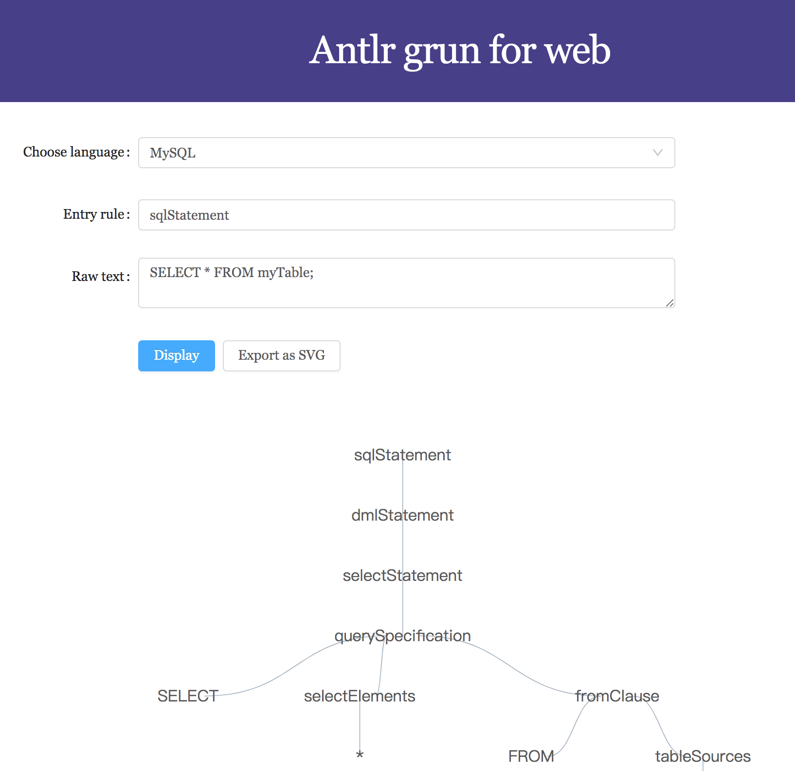

# antlr-grun-web
Display parse tree visually in web browser just like Antlr grun.[Online Demo](https://xiaoiver.github.io/antlr-grun-web).


Usually we use Antlr [grun](https://github.com/antlr/antlr4/blob/master/doc/getting-started.md) to display a parse tree. But when I try to implements a web editor with SQL formmating function, I found the following drawbacks:
* I've already generated the JS runtime code for my Lexer and Parser used in my web editor, but grun only supports the Java version. So I have to regenerate runtime code for Java target.
* It's hard to select a certain treenode which means I have to type the node's name manually when writing its formatting rule.
* I have to rerun grun when I want to display another SQL.

So I try to use some web technologies:
* [G6](https://www.npmjs.com/package/@antv/g6) for displaying the whole parse tree, and using SVG as renderer with some CSS rules, it's really easy to select text in every treenode.
* Antd Input component for typing SQL
* [Antlr JS target](https://github.com/antlr/antlr4/blob/master/doc/javascript-target.md)
* create-umi boilerplate

Since this is a TypeScript project, I use [antlr4ts](https://github.com/tunnelvisionlabs/antlr4ts) to generate TypeScript target code instead of antlr.

## Getting Started

Install dependencies
```bash
yarn
```

Start a dev-server
```
yarn start
```

## Support other languages

Compiling MySQL grammar using [antlr4ts](https://github.com/tunnelvisionlabs/antlr4ts):
```
yarn antlr4ts
```

Then add this language in config:
```typescript
// src/languages/index.ts
import { MySqlLexer } from './mysql/MySqlLexer';
import { MySqlParser } from './mysql/MySqlParser';

const languages: ILanguage[] = [
  {
    /**
     * display name in Select component
     */
    displayName: 'MySQL',
    lexer: MySqlLexer,
    parser: MySqlParser,
    /**
     * entry rule defined in parser
     */
    entry: 'sqlStatement',
  },
];
```
